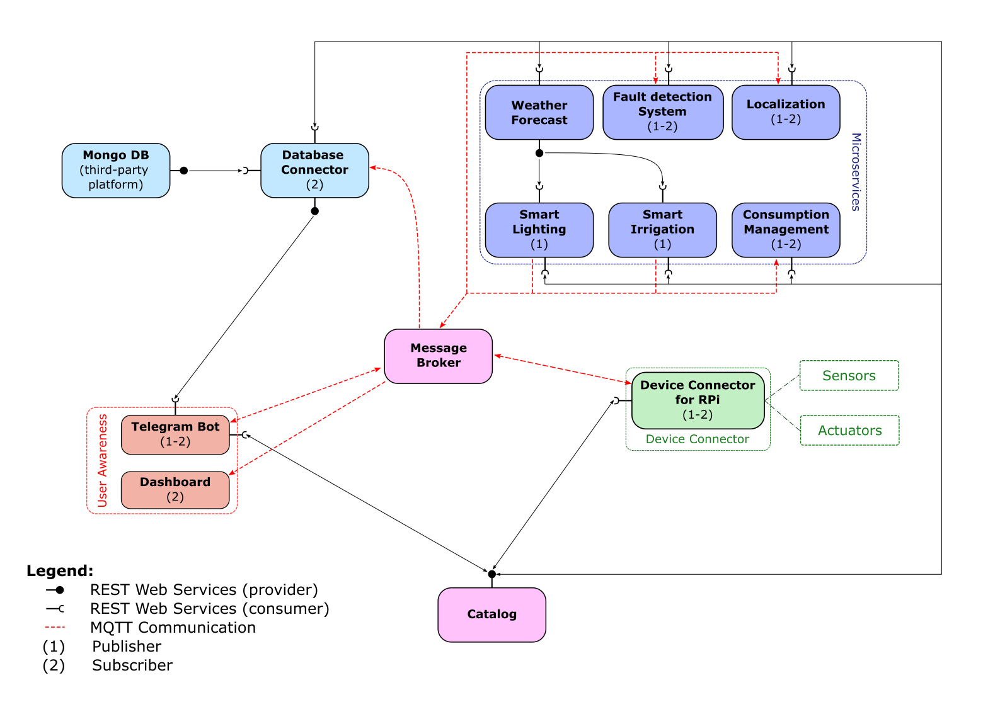

# IoT Platform

The IoTomaoes IoT platform is a set of microservices that allow the management of a Smart Farming infrastructure. It is based on the microservices design pattern. It is developed in Python and it exploits the CherryPy framework to provide REST Web Services and the paho-mqtt library to provide MQTT services. It also exploits the MongoDB database to store the data.

The IoT platform provides both push notification to the users in the company that a dashboard to actively visualize the data. The company employees can interact and monitor the status of the coltures

The proposed IoT platform will basically exploit 2 types of communication paradigms:
- **PUBLISH/SUBSCRIBE:** based on the usage of the MQTT protocol;
- **REQUEST/RESPONSE:** based on REST Web Services.

## Launcher
The **[docker-compose.yml](./docker-compose.yml)** file is a script that allows to build and run all the microservices of the IoT platform in a single command. In the configuration it uses a bridge network to allow the communication between the microservices. It also uses the host network to allow the communication between the services and the devices on the Raspberry Pi board.

Together with all the microservices, it also launches:
- the NGINX server that allow the communication between the services in the platform and the external world.
- the MOSQUITTO broker that works as a MQTT broker to allow the communication between the services in the platform and the external devices.

## Resource Catalog
It works as a REST Web Service and provides information about endpoints (URI and MQTT topics) of all the devices in the platform. Therefore, each IoT device will need to be registered and must be able to update it periodically.
Moreover it contains all the information about the users and the companies of the platform.

**[Code >>](./ResourceCatalog/)**  

**[Example of ResourceCatalog >>](https://github.com/Matteo-Sperti/IoTomatoes/blob/main/Doc/ResourceCatalog.json)**

## Service Catalog
It works as a REST Web Service and provides information about endpoints (URI and MQTT topics) of all the REST Web Services (including the Resource Catalog) in the platform. 

**[Code >>](./ServiceCatalog/)**  

**[Example of ServiceCatalog >>](https://github.com/Matteo-Sperti/IoTomatoes/blob/main/Doc/ServiceCatalog.json)**

## Database Connector
It works as a REST Web Service and provides the possibility to store and retrieve data from the MongoDB database. It also exploits the MQTT protocol to receive messages from the different sensors and microservices.

**[Code >>](./MongoDBConnector/)**  

## Telegram Bot
It is a service that allows the integration of the IoT infrastructure into Telegram platform. 
This service will allow the user to manage his company through Telegram. The user will be able to:
- register a new company;
- register himself as a new user of the company;
- delete a company;
- visualize the list of the devices or of the users of the company;
- change the plant type in a field;
- plot the sensor data
- retrieve the position of the devices and of the trucks.
It will exploit REST Web Services to retrieve IoT devices data from the Database Connector, the Data Visualizer or the localization service. Moreover, it will exploit the MQTT protocol to receive messages and alarms from the different microservices.

**[Code >>](./TelegramBot/)**  

## Dashboard
It is used to retrieve and visualize data from IoT devices of the platform through a MQTT subscriber. It will be realized through Node-RED. The company user will be able to visualize the data of the sensors and the actuators of the farm. Moreover, it will be possible to visualize the weather forecast, the position of the trucks and the notifications of the platform.

## Fault Detection System 
This service performs different data control strategies in order to ensure that each IoT device data is consistent and identify some possible failures and malfunctions in the platform.

**[Code >>](./FaultDetectionService/)**  

## Consumption Management
It will retrieve and store data about power consumption from the actuators. It subscribes actuators' topics and compute an estimate of the power consumption of the company. Through this service the company can have a picture of its consumption (and so of its outgoings) and can reduce the impact on the environment.

**[Code >>](./ConsumptionManager/)** 

## Resource Manager
This service control and notify the user (it publish a message on the MQTT broker) when a device is added, updated or removed from the platform. The user receives a message on the Telegram Bot and can also visualize the notification on the Dashboard.

**[Code >>](./ResourceManager/)**

## Smart irrigation
This service is used to automatically manage the irrigation plant of the farm.

**[Code >>](./SmartIrrigation/)**  

## Smart lighting
This service retrieves sensors data already processed by the MongoDBConnector, retrieve the weather Forecast and integrate all this informations to obtain an autonomous control of the lighting system.

**[Code >>](./SmartLighting/)**   

## Weather Forecast
This service uses third-party API to retrieve the weather information and forecast for the farm area. Moreover, it exploits the possibility to include in the analysis data coming from pre-existing weather stations (further updates of the project)

**[Code >>](./WeatherForecast/)**  

## Localization
This service uses third-party API and GPS present in all the machineries to localize them in the field and track their movement during the work hours. With this solution, the company can easily keep track of the work done and plan next operations for the following days.

**[Code >>](./Localization/)**  

## Data Visualizer
This service is used to visualize the data of the sensors and the actuators of the farm. It retrieves data from the MongoDB database and it construct png images that are sent to the Telegram Bot.

**[Code >>](./DataVisualizer/)**