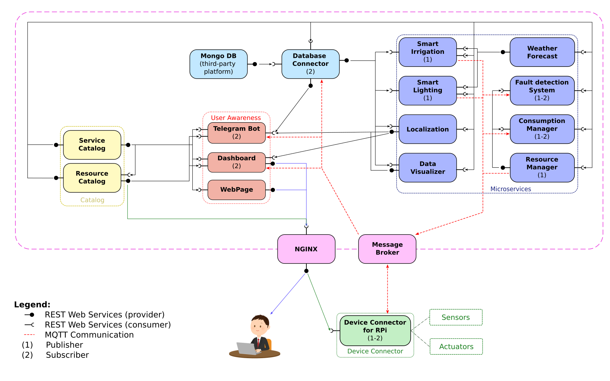

# IoTomatoes

IoT project for smart-agriculture.
IoTomatoes allows support to farmers and agri-service providers in order to increase productivity, optimize use of water and light, reducing the impact on the environment.

The proposed IoT platform integrates different IoT devices in order to provide a suitable control strategy and data analysis for agricultural holdings management and grow different types of crops. It also guarantees standardized communication interfaces (REST and MQTT) to easily communicate with pre-existing sensors.

The main features provided by the platform will be:
- Consumption management;
- Machineries geolocalization;
- Irrigation and lighting control;
- Environment and soil data analysis;
- Unified interfaces (REST Web Services and MQTT);
- End-users’ maintenance and awareness.

# Installation

The required packages to run the IoT platform are:

- [Python 3.x](https://www.python.org/)
- [NumPy](https://numpy.org/)
- [CherryPy](https://cherrypy.dev/)
- [paho-mqtt](https://www.eclipse.org/paho/index.php?page=clients/python/index.php)
- [docker](https://www.docker.com/)
- [requests](https://requests.readthedocs.io/en/latest/#)

Moreover it is suggested to install the IoT support package [IoTomatoes_SupportPackage](./IoTomatoes_SupportPackage/README.md) that contains some useful functions to simplify the development of the IoT devices.

    python -m pip install -i https://test.pypi.org/simple/ IoTomatoes_SupportPackage --no-deps

 # Docker Compose

The docker compose file is a script that allows to build and run all the microservices of the IoT platform in a single command. It is possible to launch the microservices in 2 different ways:

- **[docker-compose.yml](./docker-compose.yml)** is the test version of the docker compose file. It is used to test the platform in a local environment. It build all the microservices and 5 more container with simulated devices. In the configuration it uses 
a bridge network to allow the communication between the microservices. It also uses the host network to allow the communication between the services and the devices (both simulated or deployed on a real Raspberry Pi board).

- **[docker-compose.prod.yml](./docker-compose.prod.yml)** is the production version of the docker compose file. It is used to deploy the platform in a production environment. It build only the microservices. In the configuration it uses a bridge network to allow the communication between the microservices. It also uses the host network to allow the communication between the services and the devices on the Raspberry Pi board.

# Contents

The proposed IoT platform for Smart Farming is built on the base of the microservices design pattern. It will basically exploit 2 types of communication paradigms:
- **PUBLISH/SUBSCRIBE:** based on the usage of the MQTT protocol;
- **REQUEST/RESPONSE:** based on REST Web Services.

## Device Connector
Device connector for Raspberry Pi: It works as a device connector integrating the low-level technology of sensors  and actuators into the platform. The Raspberry Pi board communicates using low-energy communication protocols with temperature, humidity, air quality, solar radiations, soil moisture sensors located in the field, to retrieve environmental and soil information, or with leds and pumps. It communicates with the Catalog through REST and it works as a MQTT publisher to send the data collected, or as a MQTT subscriber to receive the actuation commands. It can be also used to integrate pre-existing sensors in the platform.

**[Code >>](./Devices/)**  

## Resource Catalog
It works as a REST Web Service and provides information about endpoints (URI and MQTT topics) of all the devices in the platform. Therefore, each IoT device will need to be registered and must be able to update it periodically.

**[Code >>](./ResourceCatalog/)**  

## Service Catalog
It works as a REST Web Service and provides information about endpoints (URI and MQTT topics) of all the REST Web Services (including the Resource Catalog) in the platform. 

**[Code >>](./ServiceCatalog/)**  

## Database Connector
prova

**[Code >>](./Connector/)**  

## Telegram Bot
It is a service that allows the integration of the IoT infrastructure into Telegram platform. It will exploit REST Web Services to retrieve IoT devices data from the Database Connector. Moreover, it will exploit the MQTT protocol to receive messages and alarms from the different microservices and it provides the possibility to manage your company.

**[Code >>](./TelegramBot/)**  

## Dashboard
It is used to retrieve and visualize data from IoT devices of the platform through a MQTT subscriber. It will be realized through Node-RED.

## Fault Detection System 
This service performs different data control strategies in order to ensure that each IoT device data is consistent and identify some possible failures and malfunctions in the platform.

**[Code >>](./FaultDetectionService/)**  

## Smart irrigation
This service is used to manage the irrigation plant of the farm.

**[Code >>](./SmartIrrigation/)**  

## Smart lighting
This service retrieves solar lighting data from the sensors using the MQTT protocol and automatically controls the lighting system.

**[Code >>](./SmartLighting/)**  

## Consumption Management
It will retrieve and store data about main resources consumption (water, average electrical power, seed and fertilizer) from related REST Web Services. Through this service the company can have a picture of its consumption (and so of its outgoings) and can reduce the impact on the environment.

**[Code >>](./ConsumptionManager/)**  

## Weather Forecast
This service uses third-party API to retrieve the weather information and forecast for the farm area. Moreover, it exploits the possibility to include in the analysis data coming from pre-existing weather stations.

**[Code >>](./WeatherForecast/)**  

## Localization
This service uses third-party API and GPS present in all the machineries to localize them in the field and track their movement during the work hours. With this solution, the company can easily keep track of the work done and plan next operations for the following days.

**[Code >>](./Localization/)**  

# Authors

- [Matteo Sperti](https://github.com/Matteo-Sperti)
- [Federico Moscato](https://github.com/JMFede)
- [Andrea Usai](https://github.com/Andrechief98)
- [Luca Zanetti](https://github.com/lucazanett)

